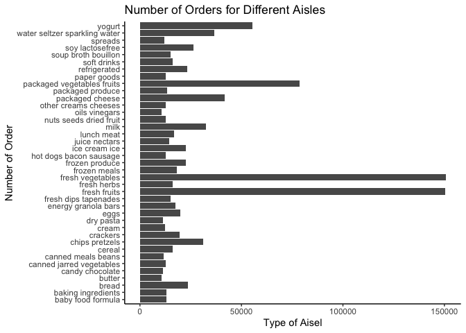

p8105_hw3_jz3571
================
Junyan Zhu
2022-10-16

``` r
library(tidyverse)
library(dplyr)
library(patchwork)
library(ggplot2)
```

# Problem 1

``` r
library(p8105.datasets)
data("instacart")
summary(instacart)
```

    ##     order_id         product_id    add_to_cart_order   reordered     
    ##  Min.   :      1   Min.   :    1   Min.   : 1.000    Min.   :0.0000  
    ##  1st Qu.: 843370   1st Qu.:13380   1st Qu.: 3.000    1st Qu.:0.0000  
    ##  Median :1701880   Median :25298   Median : 7.000    Median :1.0000  
    ##  Mean   :1706298   Mean   :25556   Mean   : 8.758    Mean   :0.5986  
    ##  3rd Qu.:2568023   3rd Qu.:37940   3rd Qu.:12.000    3rd Qu.:1.0000  
    ##  Max.   :3421070   Max.   :49688   Max.   :80.000    Max.   :1.0000  
    ##     user_id         eval_set          order_number      order_dow    
    ##  Min.   :     1   Length:1384617     Min.   :  4.00   Min.   :0.000  
    ##  1st Qu.: 51732   Class :character   1st Qu.:  6.00   1st Qu.:1.000  
    ##  Median :102933   Mode  :character   Median : 11.00   Median :3.000  
    ##  Mean   :103113                      Mean   : 17.09   Mean   :2.701  
    ##  3rd Qu.:154959                      3rd Qu.: 21.00   3rd Qu.:5.000  
    ##  Max.   :206209                      Max.   :100.00   Max.   :6.000  
    ##  order_hour_of_day days_since_prior_order product_name          aisle_id    
    ##  Min.   : 0.00     Min.   : 0.00          Length:1384617     Min.   :  1.0  
    ##  1st Qu.:10.00     1st Qu.: 7.00          Class :character   1st Qu.: 31.0  
    ##  Median :14.00     Median :15.00          Mode  :character   Median : 83.0  
    ##  Mean   :13.58     Mean   :17.07                             Mean   : 71.3  
    ##  3rd Qu.:17.00     3rd Qu.:30.00                             3rd Qu.:107.0  
    ##  Max.   :23.00     Max.   :30.00                             Max.   :134.0  
    ##  department_id      aisle            department       
    ##  Min.   : 1.00   Length:1384617     Length:1384617    
    ##  1st Qu.: 4.00   Class :character   Class :character  
    ##  Median : 8.00   Mode  :character   Mode  :character  
    ##  Mean   : 9.84                                        
    ##  3rd Qu.:16.00                                        
    ##  Max.   :21.00

``` r
insta_df = instacart
```

## How many aisles are there and which aisles are the most items ordered from?

``` r
num_aisle = insta_df %>% 
  group_by(aisle) %>% 
  summarise(total_num = n()) %>% 
  arrange(desc(total_num))

nrow(num_aisle)
```

    ## [1] 134

``` r
names(which.max(table(insta_df$aisle)))
```

    ## [1] "fresh vegetables"

``` r
num_aisle %>% 
  filter(total_num > 10000) %>% 
  ggplot() +
  geom_bar(aes(x = total_num, y = aisle), stat = "identity") +
  labs(title = "Number of Orders for Different Aisles",
       x = "Type of Aisel",
       y = "Number of Order") +
  theme_classic()
```

<!-- -->

``` r
three_pop_df = insta_df %>% 
  filter(aisle == c("baking ingredients", "dog food care", "packaged vegetables fruits")) %>% 
  group_by(aisle, product_name) %>% 
  summarise(count = n()) %>% 
  mutate(rank = min_rank(desc(count))) %>% 
  filter(rank <= 3) %>% 
  arrange(aisle, rank)
```

    ## `summarise()` has grouped output by 'aisle'. You can override using the
    ## `.groups` argument.

``` r
three_pop_df
```

    ## # A tibble: 9 × 4
    ## # Groups:   aisle [3]
    ##   aisle                      product_name                            count  rank
    ##   <chr>                      <chr>                                   <int> <int>
    ## 1 baking ingredients         Light Brown Sugar                         157     1
    ## 2 baking ingredients         Pure Baking Soda                          140     2
    ## 3 baking ingredients         Organic Vanilla Extract                   122     3
    ## 4 dog food care              Organix Grain Free Chicken & Vegetable…    14     1
    ## 5 dog food care              Organix Chicken & Brown Rice Recipe        13     2
    ## 6 dog food care              Original Dry Dog                            9     3
    ## 7 packaged vegetables fruits Organic Baby Spinach                     3324     1
    ## 8 packaged vegetables fruits Organic Raspberries                      1920     2
    ## 9 packaged vegetables fruits Organic Blueberries                      1692     3

``` r
mean_hr_df = insta_df %>% 
  filter(product_name %in% c("Pink Lady Apples", 'Coffee Ice Cream')) %>% 
  select(order_dow, order_hour_of_day, product_name) %>% 
  group_by(order_dow, product_name) %>% 
  summarise(mean(order_hour_of_day)) %>% 
  mutate(order_dow = recode(order_dow,
                            '0' = 'Sunday',
                            '1' = 'Monday',
                            '2' = 'Tuesday',
                            '3' = 'Wednesday',
                            '4' = 'Thursday',
                            '5' = 'Friday',
                            '6' = 'Saturday'))
```

    ## `summarise()` has grouped output by 'order_dow'. You can override using the
    ## `.groups` argument.

``` r
mean_hr_df
```

    ## # A tibble: 14 × 3
    ## # Groups:   order_dow [7]
    ##    order_dow product_name     `mean(order_hour_of_day)`
    ##    <chr>     <chr>                                <dbl>
    ##  1 Sunday    Coffee Ice Cream                      13.8
    ##  2 Sunday    Pink Lady Apples                      13.4
    ##  3 Monday    Coffee Ice Cream                      14.3
    ##  4 Monday    Pink Lady Apples                      11.4
    ##  5 Tuesday   Coffee Ice Cream                      15.4
    ##  6 Tuesday   Pink Lady Apples                      11.7
    ##  7 Wednesday Coffee Ice Cream                      15.3
    ##  8 Wednesday Pink Lady Apples                      14.2
    ##  9 Thursday  Coffee Ice Cream                      15.2
    ## 10 Thursday  Pink Lady Apples                      11.6
    ## 11 Friday    Coffee Ice Cream                      12.3
    ## 12 Friday    Pink Lady Apples                      12.8
    ## 13 Saturday  Coffee Ice Cream                      13.8
    ## 14 Saturday  Pink Lady Apples                      11.9

# Problem 2

``` r
acc_df = read_csv("./data/accel_data.csv") %>% 
  janitor::clean_names()
```

    ## Rows: 35 Columns: 1443
    ## ── Column specification ────────────────────────────────────────────────────────
    ## Delimiter: ","
    ## chr    (1): day
    ## dbl (1442): week, day_id, activity.1, activity.2, activity.3, activity.4, ac...
    ## 
    ## ℹ Use `spec()` to retrieve the full column specification for this data.
    ## ℹ Specify the column types or set `show_col_types = FALSE` to quiet this message.

## Load, tidy, and otherwise wrangle the data. Your final dataset should include all originally observed variables and values; have useful variable names; include a weekday vs weekend variable; and encode data with reasonable variable classes. Describe the resulting dataset (e.g. what variables exist, how many observations, etc).

``` r
tidy_acc_df = acc_df %>% 
  mutate(weekdays = ifelse(day == "Saturday" | day =="Sunday", 'weekend', 'weekday')) %>% 
  mutate(activity_daysum = rowSums(.[4:1443]))
```

There are total 35 days of observations and 1443 variables exist,
including week, day, day-id, and 1440 variables for each minute in a
day. The new created weekdays variable specifies whether a recorded day
belongs to weekday or weekend, and activity_daysum variable reflects the
total activity count for a specific day by summing all 1440 counts for a
day.

## Traditional analyses of accelerometer data focus on the total activity over the day. Using your tidied dataset, aggregate across minutes to create a total activity variable for each day, and create a table showing these totals. Are any trends apparent?

``` r
tidy_acc_df %>%  
  select(week, day, activity_daysum) %>% 
  arrange(week, day) %>% 
  knitr::kable()
```

| week | day       | activity_daysum |
|-----:|:----------|----------------:|
|    1 | Friday    |       480542.62 |
|    1 | Monday    |        78828.07 |
|    1 | Saturday  |       376254.00 |
|    1 | Sunday    |       631105.00 |
|    1 | Thursday  |       355923.64 |
|    1 | Tuesday   |       307094.24 |
|    1 | Wednesday |       340115.01 |
|    2 | Friday    |       568839.00 |
|    2 | Monday    |       295431.00 |
|    2 | Saturday  |       607175.00 |
|    2 | Sunday    |       422018.00 |
|    2 | Thursday  |       474048.00 |
|    2 | Tuesday   |       423245.00 |
|    2 | Wednesday |       440962.00 |
|    3 | Friday    |       467420.00 |
|    3 | Monday    |       685910.00 |
|    3 | Saturday  |       382928.00 |
|    3 | Sunday    |       467052.00 |
|    3 | Thursday  |       371230.00 |
|    3 | Tuesday   |       381507.00 |
|    3 | Wednesday |       468869.00 |
|    4 | Friday    |       154049.00 |
|    4 | Monday    |       409450.00 |
|    4 | Saturday  |         1440.00 |
|    4 | Sunday    |       260617.00 |
|    4 | Thursday  |       340291.00 |
|    4 | Tuesday   |       319568.00 |
|    4 | Wednesday |       434460.00 |
|    5 | Friday    |       620860.00 |
|    5 | Monday    |       389080.00 |
|    5 | Saturday  |         1440.00 |
|    5 | Sunday    |       138421.00 |
|    5 | Thursday  |       549658.00 |
|    5 | Tuesday   |       367824.00 |
|    5 | Wednesday |       445366.00 |

There is no obvious pattern if we extract the table for total activity
acount for each day. Let’s try grouping the activity acount by specific
day in the week.

``` r
tidy_acc_df %>% 
  group_by(day) %>% 
  summarise(mean_acitivity = mean(activity_daysum)) %>% 
  knitr::kable()
```

| day       | mean_acitivity |
|:----------|---------------:|
| Friday    |       458342.1 |
| Monday    |       371739.8 |
| Saturday  |       273847.4 |
| Sunday    |       383842.6 |
| Thursday  |       418230.1 |
| Tuesday   |       359847.6 |
| Wednesday |       425954.4 |

There is still no obvious patter showed on the mean of activity for each
specific day in the week. Wednesday, Thursday and Friday has higher
activity acount than other days. Let’s try grouping by weekdays and
weekends.

``` r
tidy_acc_df %>% 
  group_by(weekdays) %>% 
  summarise(mean_activity = mean(activity_daysum)) %>% 
  knitr::kable()
```

| weekdays | mean_activity |
|:---------|--------------:|
| weekday  |      406822.8 |
| weekend  |      328845.0 |

Now we can see that weekdays have higher mean value of daily activity
count than weekends.
